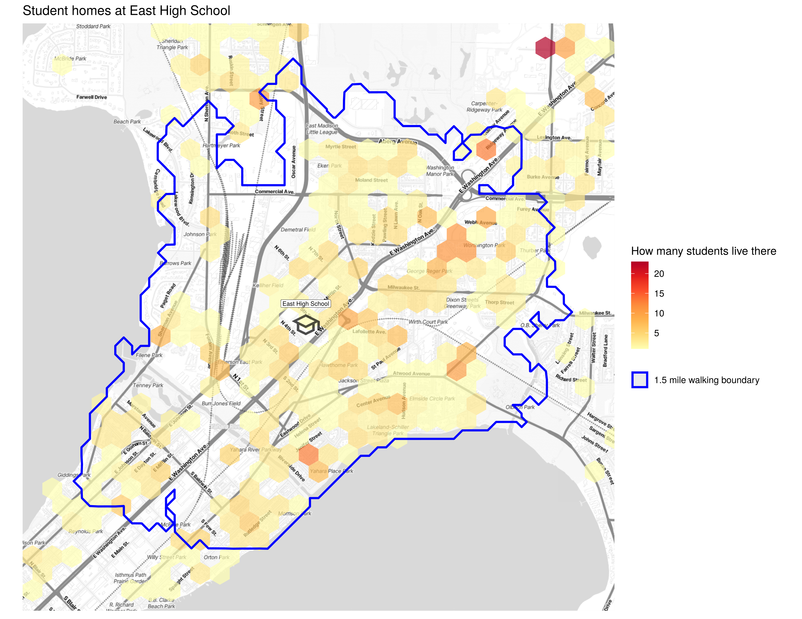
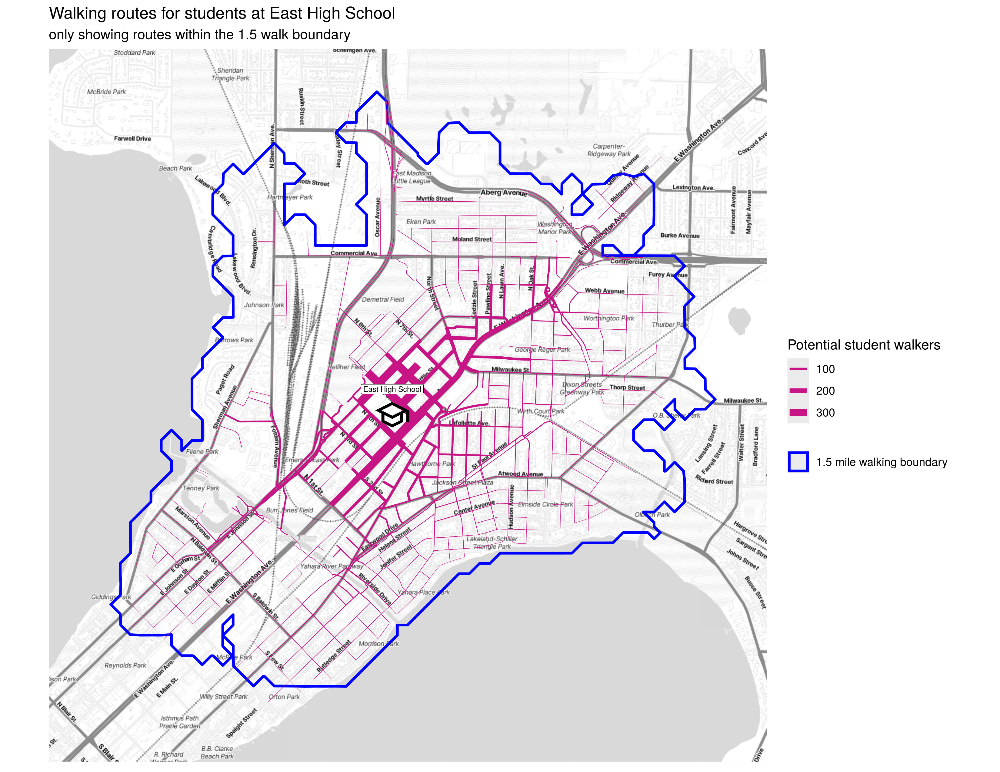
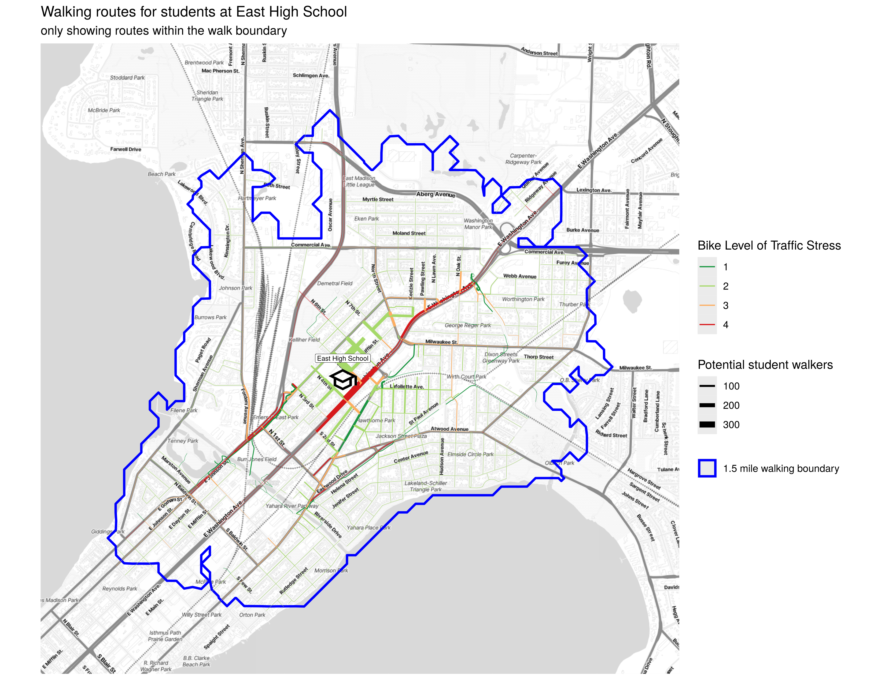
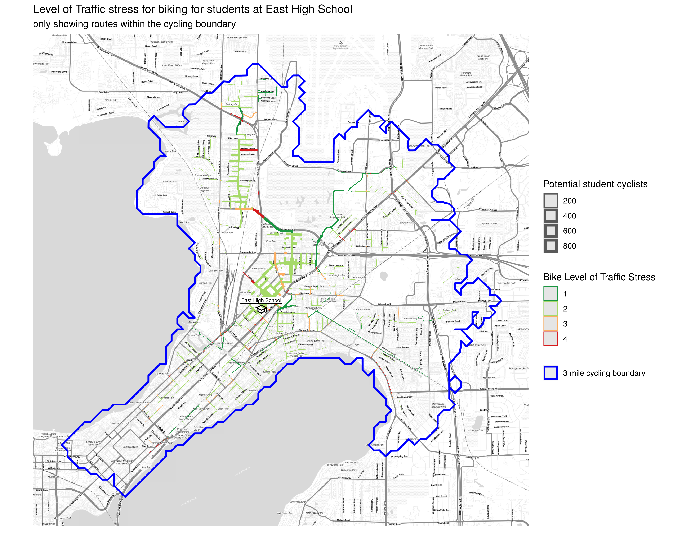

## Routes for walking to school
This script generates maps to analyze the potential walking routes for students to their school.

- I excluded the addresses of the students from the repository.
- The actual route generation is done with [`brouter`](https://github.com/abrensch/brouter) (using the *safety* profile) and [`OSRM`](https://github.com/Project-OSRM/osrm-backend) (for the boundary polygons), those are run locally in docker containers.
- The basemap is pulled from Stadia Maps. The usage of the script is well within the free tier, you'll need an API key from them.

## Data sources
- School location data is from: https://data-wi-dpi.opendata.arcgis.com/
- Madison Bike Level of Traffic Stress is from: https://data-cityofmadison.opendata.arcgis.com/datasets/cityofmadison::bike-lts/explore
- Student addresses provided by school.

## Example figures
This script will generate a few figures:
### A heatmap of student addresses:

### A map of all the walking routes within the walk boundary:

### A map of those walking routes colored by the level of traffic stress to bike

### A map of cycling routes colored by the level of traffic stress to bike (with a 3 mile radius)

## Using make
- `make osrm-data`: downloads the OpenStreetMap data for Wisconsin, and preproccesses it for use with OSRM.
- `make osrm-container`: starts the OSRM containers (backends and frontends) for walking and biking.
- `make brouter-data`: clones the repositories for brouter and brouter-web and downloads the segment data. It also builds the docker images for brouter and brouter-web.
- `make brouter-container`: starts the brouter containers (backend and frontend).
- `make walk` will run *route_analysis.Rmd* which
calculates the walking routes using OSRM.
- `make cycle-osrm` will run *cycling_route_analysis.Rmd* which calculates the biking routes using OSRM.
- `make cycle-brouter` will run *cycling_route_analysis_brouter.Rmd* which calculates the biking routes using brouter.

## What-if analysis
This allows you to make changes to the street network (add a bike path, reduce a lane on an arterial st) and see how it affects the routes that brouter chooses.
This is a multi-step process:
1. Make edits to OpenStreetMap in [JOSM](https://josm.openstreetmap.de/)
2. Save the edited map as `docker/brouter/osm_edit/map_edited.osm` (File -> Save As)
3. `make osm_edit_refresh_base` will download a fresh copy of `wisconsin-latest.osm.pbf` and the elevation tiles for Wisconsin. You don't need to run this frequently.
4. `make osm_edit_generate_pbf` will take those edits and apply them to the `wisconsin-latest.osm.pbf` and generate `wisconsin-latest_edited.osm.pbf`
5. `make osm_edit_generate_brouter` will generate new brouter segment files from the edited pbf file.

## Misc.
- [Bike Level of Traffic Stress (LTS)](https://www.dvrpc.org/webmaps/bike-lts/analysis/)

## OpenStreetMap Data
- [wisconsin-latest.osm.pbf](https://download.geofabrik.de/north-america/us/wisconsin-latest.osm.pbf)
